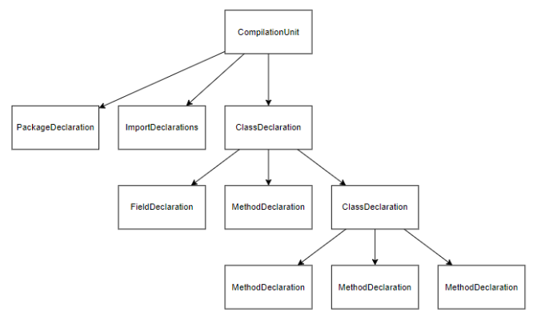

# Парсеры

## Для чего нам парсинг

### Подсветка синтаксиса
Подсветка синтаксиса необходима для улучшения читаемости и понимания контекста кода.  
Например, комментарии, ключевые слова, литералы и т.п. выделяются разными цветами

### Поиск локальных declaration/usages
Find declaration/usages помогают понять где объявлен или где используется данный элемент,
для того чтобы лучше ориентироваться в файле
Может быть полезен при рефакторинге кода, или code review

### Получение дерева интервалов документа
Дерево интервалов документа хранится и изменяется вместе с документом
На данный момент используется для инкрементального парсинга

## Процесс парсинга
Для построения лексических и синтаксических анализаторов используется парсер-генератор ANTLR. 
Грамматики для языков берутся [из официального github репозитория ANTLR](https://github.com/antlr/grammars-v4).
Сама библиотека содержит некоторые конфликтующие с TeaVM вещи, поэтому используем
[совместимую с TeaVM версию ANTLR](https://github.com/pertsevpv/antlr4-teavm-compatible)

Если файл достаточно небольшой, то обычно его полный синтаксический анализ не займет много времени.  
Однако, файлы могут быть достаточно большими и их парсинг может занять продолжительное время,
а какой-то результат пользователь хочет увидеть сразу.
Поэтому парсинг файла можно разделить на следующие этапы:

1. Лексический анализ первых N линий
2. Парсинг структуры файла + парсинг вьюпорта пользователя
3. Полный парсинг

Результат работы любого из анализаторов передается затем в ParserUtils в виде массива int[] result,
где позже из него собирается Document.
Подобный способ передачи результата вызван особенностями многопоточности в Web-браузере.
В result хранится информация о:
1. Количестве линий документа
2. Для каждой линии - кол-во находящихся в нем элементов кода
3. Для каждого элемента кода - индексы начала и конца в изначальном тексте, тип и стиль элемента
4. Количестве элементов для каждой линии
5. Структуре файла в виде дерева интервалов
6. Найденные пары declaration-usage

### Лексический анализ первых N строк
Лексический анализ в отличие от синтаксического можно выполнить
достаточно быстро. Поэтому, при открытии файла мы можем произвести
лексический анализ строк, попадающих во вьюпорт пользователя и
еще N строк из его окрестности и, получив последовательность токенов, быстро
подсветить некоторые ключевые слова и литералы. При таком парсинге нельзя
сделать никаких представлений о структуре документа

###  Парсинг структуры файла 
Ключевая идея этого метода парсинга в том в проведении
синтаксического анализа полного исходного файла, но по сильно упрощенной
грамматике, которая ориентируется только на некоторые ключевые конструкции
языка, а остальные символы - пропускает. Например в языке Java – некоторые
ключевые слова и символы, а также скобочные последовательности могут дать
нам представление о том, какой перед нами элемент структуры. Все же
остальные токены, такие как идентификаторы, литералы мы можем
игнорировать. На выходе такого парсинга мы получаем дерево интервалов, а
также пользователь теперь имеет доступ ко всему файлу, но без подсветки.  
Данный метод парсинга текста позволяет заметно сократить время
предоставления пользователю корректной расцветки, так как обрабатывается
сильно меньшее количество токенов.
Сразу после этого парсинга, мы можем запустить полный парсинг, но
только тех интервалов, которые в настоящий момент находятся на вьюпорте
пользователя и некоторой его окрестности, а это заметно меньше чем полный
файл.  
На данный момент такой метод поддержан только для Java 

### Полный парсинг
В данном методе, анализаторы получают на вход весь текст исходного
кода. После проведения лексического анализа, синтаксический анализатор
проводит разбор последовательности токенов по стартовому правилу
грамматики языка

Результаты сравнения показаны на таблице ниже. Как видно из
результатов, лексический анализ сильно выигрывает по времени, однако
предоставляет плохую подсветку текста. Структурный парсинг в большинстве
случаев заметнее быстрее полного. На большинстве файлов, выигрыш более
чем в 4 раза заметен.

 Сравнительная таблица методов парсинга  

https://github.com/pertsevpv/ParserDemo/assets/57060856/3ba54db4-e2f4-4233-890c-64e00a85c6a7

Демонстрация работы парсеров.

### Обход деревьев

Процесс обхода дерева происходит по заданному правилу грамматики,
начиная с корня и рекурсивно спускаясь вниз поиском в глубину. В процессе
обхода правила грамматики обрабатываются следующим образом:
- При заходе в объявление локальной переменной добавляем ее название и позицию,
где она была объявлена в список для текущей области видимости. Также пытаемся 
вывести тип этой переменной
- При заходе в правила, обозначающие объявление поля/метода/конструктор класса,
вносим данное поле/метод/конструктор в список для класса, где он был объявлен. Для
метода/конструктора также добавляем его аргументы в список для текущей области видимости.
Объявления поля подсвечивается фиолетовым, метода/конструктора - желтым
- При заходе в идентификатор, который мог бы обозначать обращение к переменной,
пытаемся найти соответствующее объявление.  Процесс поиска происходит
следующим образом. Если явно подразумевалось обращение к полю (например через this)
то ищем только по полям класса. Если поле в классе не найдено - помечаем как ошибку.
В общем же случае, сначала пытаемся найти объявление в текущей области видимости. При
ненахождении - ищем среди полей класса. Если нужное объявление было найдено, то пара
использование-объявление добавляется в Map<Decl, Decl> usageToDef
- При заходе в вызов метода, процесс поиска происходит схожим образом. Однако, нам нужно
учитывать типы аргументов в функции. Если было объявлено несколько функций с разными типами
аргументов, то выбираем ту которая подходит по типам. Если тип какого-либо аргумента
определить не удалось, тогда при поиске он может считаться за любой тип.
- При заходе в выражение, пытаемся определить его тип. Есть несколько правил:
  - Буленовы выражения определяются как boolean
  - Унарные/бинарные операции - как тип первого операнда
  - Тернарный оператор - тип первого выражения
  - Литералы - тип литерала
  - Переменная/поле/вызов метода/конструктора - ищем соответствующее объявление. Если нашли - его
  тип, не нашли - помечаем как null
- При посещении терминальной вершины смотрим к какому типу относится токен:
если он представляет из себя ключевое слово, литерал комментарий или другие
специфичные для языка конструкции, подсвечиваем его соответствующим образом.

https://github.com/pertsevpv/ParserDemo/assets/57060856/f1fed374-1579-4c4d-a824-c2e9773b48e4

Пример поиска declaration для локальных переменных, методов и конструкторов

https://github.com/pertsevpv/ParserDemo/assets/57060856/a9c6b998-eef4-44ff-b996-0a43beafb6bb

Пример поиска declaration нужного метода по типам

### Инкрементальный парсинг
При редактировании, структура файла может измениться и тогда
понадобится обновить подсветку текущего сегмента. Однако, заново запускать
полный парсинг на всем файле займет слишком много времени. Поэтому при
внесении в документ изменений, также вносятся изменения и в дерево
структуры. При этом соответствующий узел дерева помечается как
нуждающийся в обновлении. После того как пользователь закончил печатать, к
интервалам, нуждающимся в обновлении, применятся полный парсинг.
Это позволяет поддерживать корректную структуру документа и
правильную подсветку синтаксиса.

https://github.com/pertsevpv/ParserDemo/assets/57060856/839d103f-cf79-463c-afe0-70f7a9e0f85d

## Известные проблемы

### Несоответствие файла грамматике языка
Если файл не соответствует грамматике языка, то выполнить корректный синт. анализ 
не получится. В таком случае будут нужным образом будут подсвечены лишь ключевые слова,
литералы и т.п.

### Инкрементальный парсинг
Как было сказано выше, при редактировании файла парсится только тот интервал, где было
внесено изменение. Таким образом, если в интервале находится использование поля,
которое было объявлено вне этого интервала, то его declaration не может быть найдено

https://github.com/pertsevpv/ParserDemo/assets/57060856/ef5e3813-cf25-4fe4-a329-fb7dd1294d53

